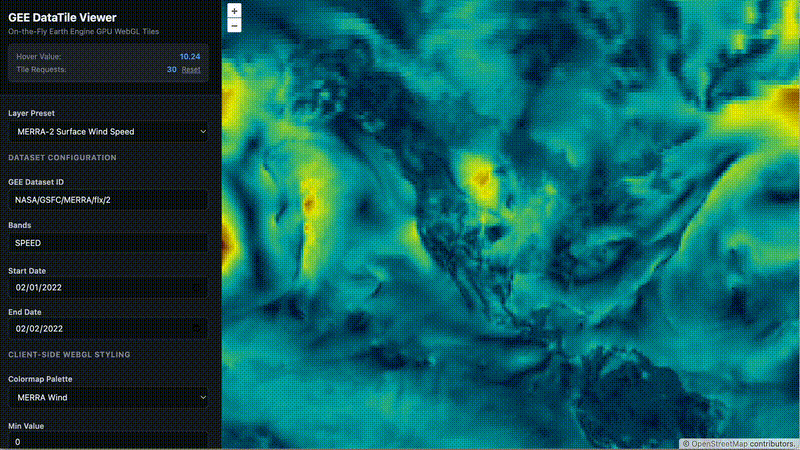
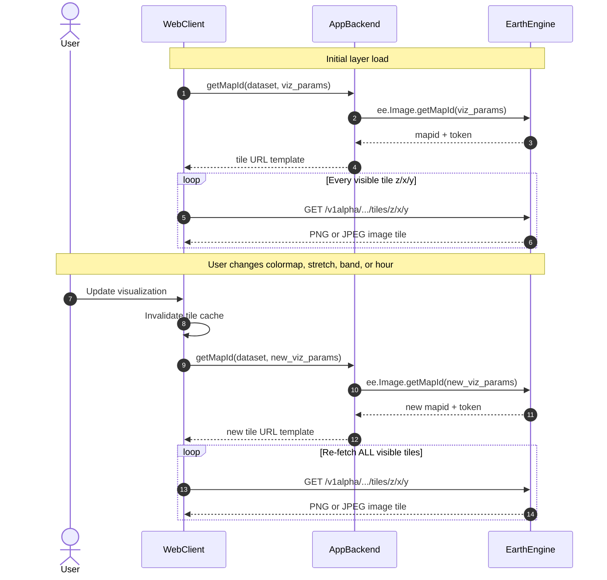
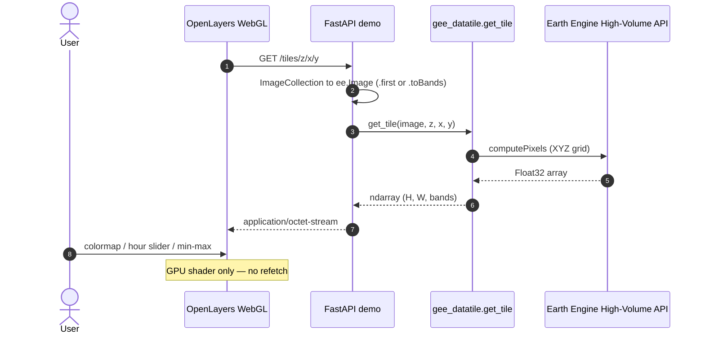
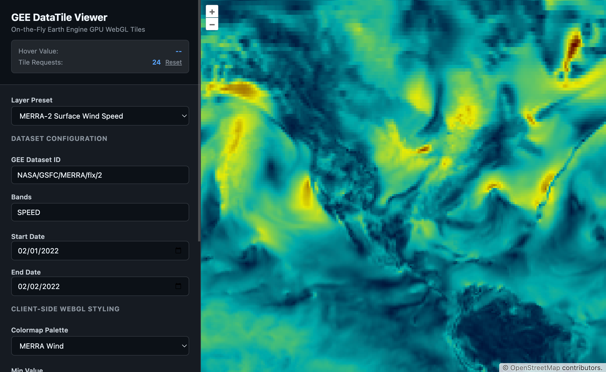

# gee-datatile



**Live demo behavior:** tiles fetch once as raw Float32 arrays; changing colormap, contrast, or the hour slider only updates the WebGL shader — the tile request counter stays flat.

A minimal Python package plus demo app for streaming **raw Float32 XYZ tiles** from Google Earth Engine to OpenLayers `DataTile` / `WebGLTile`.

| Layer | Role |
|---|---|
| **`gee_datatile`** | Core library — one function: `get_tile(ee.Image, z, x, y)` |
| **`backend/` + `frontend/`** | Demo FastAPI tile server + OpenLayers viewer (not required to use the package) |

The library accepts a computed **`ee.Image` only**. `ee.ImageCollection` is rejected — reduce first with `.first()`, `.mosaic()`, or `.toBands()`. Catalog IDs like `NASA/GSFC/MERRA/flx/2` are collections, not images.

---

## Install

```bash
python -m venv venv
source venv/bin/activate
pip install -e ".[demo]"   # library + demo server
# or
pip install -e .           # library only
```

Earth Engine must be initialized in your process (`ee.Initialize(...)`).

---

## Core API

```python
from gee_datatile import get_tile
```

### `get_tile(image, z, x, y, *, tile_size=256, crs="EPSG:3857", expected_bands=None)`

| Argument | Type | Description |
|---|---|---|
| `image` | `ee.Image` | Computed Earth Engine image. **Not** an `ImageCollection`. |
| `z, x, y` | `int` | XYZ tile index (same as OSM / OpenLayers). |
| `tile_size` | `int` | Output width and height in pixels (default 256). |
| `crs` | `str` | Sampling grid CRS (default `EPSG:3857`). |
| `expected_bands` | `int \| None` | If set, validate band dimension (e.g. `24` for hourly `toBands()` stack). |

**Returns:** `np.ndarray` of dtype `float32`, shape `(tile_size, tile_size, bands)`.

**Raises:**

| Exception | Meaning |
|---|---|
| `GeeDataTileError` | Argument is not an `ee.Image` (e.g. passed an `ImageCollection`). |
| `EmptyTileError` | No finite pixels in the sampled tile. |
| `TileShapeError` | Wrong byte count or band dimension. |
| `GeeTileError` | Earth Engine `computePixels` failed after retries. |

OpenLayers payload:

```python
tile.tobytes()  # application/octet-stream, bandCount = tile.shape[2]
```

### Example

```python
import ee
from gee_datatile import get_tile

ee.Initialize(opt_url="https://earthengine-highvolume.googleapis.com")

# MERRA-2 is an ImageCollection — reduce to an Image with toBands()
image = (
    ee.ImageCollection("NASA/GSFC/MERRA/flx/2")
    .filterDate("2022-02-01", "2022-02-02")
    .select("SPEED")
    .toBands()
)

tile = get_tile(image, z=3, x=2, y=3, expected_bands=24)
print(tile.shape, tile.dtype)  # (256, 256, 24) float32
```

Passing the collection itself fails on purpose:

```python
get_tile(ee.ImageCollection("NASA/GSFC/MERRA/flx/2"), 3, 2, 3)
# GeeDataTileError: get_tile() expects ee.Image, not ee.ImageCollection.
```

---

## Motivation

Standard Earth Engine web maps pre-render rasters on the server as **PNG/JPEG tile layers**. Visualization parameters — colormap, min/max stretch, band combination, opacity, or timestep — are baked into each tile at export time. Any change to those parameters invalidates the entire layer: the client must fetch a **new map token** and **re-download every visible tile** from Earth Engine.

That pattern works for static maps. It breaks down for interactive analysis where a user drags a contrast slider, scrubs through 24 hourly wind fields, or toggles NDVI thresholds. Each adjustment triggers a full tile pyramid refresh, adding seconds of latency and repeated GEE compute for pixels the client already had in memory as numbers.

**gee-datatile** inverts this: fetch raw Float32 values once per viewport, then restyle on the GPU.

### Standard flow — new tile layer on every visualization change

Each user edit produces a new rendered layer. The client cannot reuse prior tiles because the bytes are already colored RGBA, not raw values.



### gee-datatile flow — fetch once, style on the GPU

Raw values are fetched a single time per tile coordinate. Colormap, stretch, and hourly band selection are WebGL shader updates with **no additional GEE requests**.



---

## Demo app



The FastAPI + OpenLayers viewer is a reference implementation, not part of the library API.

1. Copy `.env.example` to `.env` and set credentials (see [Security](#security) below).
2. `pip install -e ".[demo]"`
3. `python backend/main.py`
4. Open `http://localhost:8000/static/index.html`

**Demo features:**

- Layer presets: MODIS NDVI, Copernicus Land Cover 100m, MERRA-2 temperature, MERRA-2 wind speed
- Date range filtering on ImageCollections
- **Hourly stack:** MERRA `toBands()` → 24-band tile; hour slider pages bands on the GPU without refetch
- Live pixel inspector, tile request counter, debug logging toggle
- HTTP **404 / 422 / 502** on empty or failed tiles — no zero-filled fallbacks

---

## Security

**Never commit credentials.** This repo is configured to ignore:

- `.env` (local secrets — use `.env.example` as a template)
- `*-key.json`, `service-account*.json`, and other credential files

Set credentials only in `.env`:

```ini
GEE_SERVICE_ACCOUNT=your-service-account@your-project.iam.gserviceaccount.com
GEE_KEY_FILE=/absolute/path/to/key.json
GEE_PROJECT=your-gcp-project-id
GEE_OPT_URL=https://earthengine-highvolume.googleapis.com
```

Point `GEE_KEY_FILE` at a JSON key **outside** the repository. Rotate any key that was ever committed or shared.

---

## Project layout

```
gee_datatile/          # pip-installable library (get_tile)
backend/               # FastAPI demo server
frontend/              # OpenLayers viewer
media/                 # demo.gif, screenshots
pyproject.toml
```
